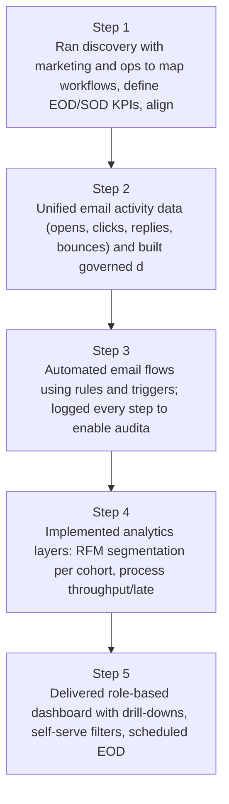
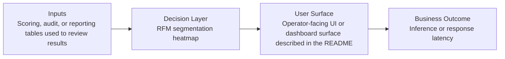
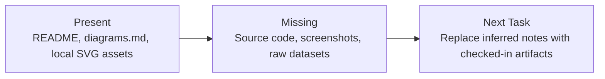

# Marketing Process Analytics Dashboard Diagrams

Generated on 2026-04-26T04:29:37Z from README narrative plus project blueprint requirements.

## Marketing funnel visualization

## RFM segmentation heatmap

## Evidence Gap Map

